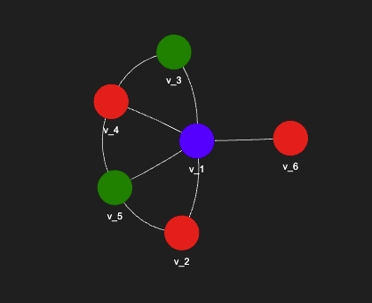

# 2-SAT for 3 Coloring

### Usage

Docker preinstalled

```shell
git clone https://github.com/hhafiya/computer_project.git
docker build -t 2-sat .
docker run -p 8000:8000 2-sat
```
### navigate to http://localhost:8000/nx.html to see result


2-SAT problem
Для реалізації задачі 2-SAT ми створили три класи: Vertice, Graph та Implication.
•	Також ми додатково використали defaultdict з бібліотеки collections для зручнішої роботи зі словниками 


class Vertice:
    """
    Class for vertices of the graph
    """
    def __init__(self, name, color, start_color = None):
        """
        Constructor of the class
        :param name: name of the vertice
        :param color: color of the vertice
        """
        self.name = name
        self.color = color+1
        self.visited = False
        self._start_color = start_color or self.color

    def __repr__(self):
        """
        Method for representation of the object
        :return: string representation of the object
        """
        return f"(v_{self.name}: color: {COLORS[self.color]}; start_color: {COLORS[self._start_color]})\n"
        return f"(v_{self.name}: color: {self.color})"

    def __eq__(self, other):
        """
        Method for comparing two objects
        :param other: object for comparing
        :return: boolean value of comparing
        """
        return self.name == other.name and self.color == other.color

    def __gt__(self, other):
        return self.name > other.name

    def __hash__(self):
        """
        Method for hashing object
        :return: hash value of the object
        """
        return hash((self.name, self.color))


Клас Vertice використовується для створення вершин графа. Veritice має атрибути name, color, visited та start_color та методи repr, eq, gt і hash.
Клас Graph використовуюється для створення графу, має один атрибут graph – словник, де ключі об’єкти Vertice, а значення – списки з вершинами-сусідами, також містить функцію читання файлу для створення графу.
    
```class Graph:
    """
    Class for graph
    """
    def __init__(self):
        """
        Constructor of the class
        """
        self.graph = defaultdict(list)
    
    def read_file(self, filename):
        """
        Method for reading data from file
        """
        with open(filename, 'r', encoding = 'utf-8') as file:
            reader = csv.reader(file)
            for row in reader:
                u, v, color_u, color_v = row
                u_node = Vertice(int(u), int(color_u))
                v_node = Vertice(int(v), int(color_v))
                self.graph[u_node].append(v_node)
                self.graph[v_node].append(u_node)
```


В функції read_file зчитуємо з файлу рядки: перша вершина, друга вершина, колір першої, колір другої. Додаємо в граф (словник) елементи, де ключ – перша вершина, значення – список, куди поступово додаємо сусідів(в тому числі друга вершина), та, оскільки граф неорієнтований, і навпаки: де ключ – це друга вершина.
Implication – основний клас, де виконується сам алгоритм.

```
class Implication:
    def __init__(self, graph):
        self.graph = graph
        self.cnf = set()
        self.imp_graph = defaultdict(list)
        self.reverse_graph = defaultdict(list)
        self.scc = []
        self.result = []
```
В цьому класі є такі атрибути:  початковий граф, КНФ- множина, imp_graph – граф імплікацій, reverse-graph – перевернутий граф імплікацій, списки scc та result  - для алгоритму Тар’яна.
```
   def generate_cnf(self):
        for node in self.graph:
            possible_col = [1, 2, 3]
            possible_col.remove(node.color)
            self.cnf.add(tuple([Vertice(node.name, new_col-1, node._start_color) for new_col in possible_col]))
            self.cnf.add(tuple([Vertice(node.name, -new_col-1, node._start_color) for new_col in possible_col]))
            for neighbour in self.graph[node]:
                for new_col in possible_col:
                    if neighbour.color != new_col and tuple([Vertice(neighbour.name, -new_col-1, \
                        node._start_color), Vertice(node.name, -new_col-1, node._start_color)]) not in self.cnf:
                        self.cnf.add(tuple([Vertice(node.name, -new_col-1, node._start_color), \
                        Vertice(neighbour.name, -new_col-1, node._start_color)]))

        self.cnf = sorted(self.cnf)
```
Функція generate_cnf генерує кон’юктивну нормальну форму з диз’юнкцій вершин.
Йдемо циклом по всіх вершинах графу. 
Створюємо список з всіма кольорами posiible_col, і видаляємо звідти поточний колір, оскільки ми не можемо змінити колір вершини на той самий. 
Додаємо в КНФ диз’юнкцію  вершин з possible_col та диз’юнкцію їх заперечень.
В результаті, ми фактично для кожного кольору в cnf отримуємо таке:
(a v b)(-a v -b) = a xor b, оскільки ми не можемо перефарбувати вершину одночасно в два кольори, то або тільки перший, або тільки другий.
 Тоді також йдемо по сусідах вершини та всередині по кольорах із possible_col і якщо колір сусідньої вершини не дорівнює можливому кольору,  додаємо диз’юнкцію заперечень поточної та сусідньої вершин з кольором, який не належить жодній з цих вершин, якщо така диз’юнкція ще не неявна в КНФ. Це робить для того, щоб не перефарбувати дві сусідні вершини в однаковий колір.
Тоді сортуємо КНФ.

```
def generate_implication_graph(self):
        for tup in self.cnf:
            first_node = tup[0]
            second_node = tup[1]
            new_first = (Vertice(first_node.name, -first_node.color-1, first_node._start_color))
            new_second = (Vertice(second_node.name, -second_node.color-1, second_node._start_color))
            self.imp_graph[new_first].append(second_node)
            self.imp_graph[new_second].append(first_node)
```            

Функція generate_graph створює граф імплікацій: замінюємо диз’юнкції на імплікації.
Йдемо циклом по всі кортежах в cnf, розділяємо кортеж на first і second node. Створюємо нові вершини: ім’я відповідної наявної вершини, та заперечення її кольору.
Тоді додаємо в граф імплікацій (словник) як ключ нову першу вершину, в список значення - попередню першу, і відповідно, як ключ – другу вершину і в список значення - попередню першу. 
Функція працює за такою логікою: 
a v b = -a -> b
b v a = -b -> a
Тому, в словник додаємо такі елементи:
imp_graph[-a]=b
imp_graph[-b]=a

```
def create_reverse_graph(self):
        for vert in self.imp_graph:
            for node in self.imp_graph[vert]:
                self.reverse_graph[node] += [vert]
```

Функція create_reverse_graph створює перевернутий граф імплікацій.

Йдемо циклом по елементах графу imp_graph і додаємо в revesed_graph елементи, де ключі – об’єкти списку значення vert, а значення – ключ vert.
В результаті отримуємо граф з такими елементами:
reverse_graph[b] = -a
reverse_graph[a] = -b

```
def dfs(self, start_vertex, graph):
        visited = []
        stack = [start_vertex]
        visited_path = []

        while stack:
            current_vertex = stack[-1]
            clear_stack = True

            if current_vertex not in visited:
                visited.append(current_vertex)
                visited_path.append(current_vertex)

            remaining_adjacents = [adj for adj in sorted(graph[current_vertex]) if adj not in visited]

            if remaining_adjacents:
                stack.append(remaining_adjacents[0])
                clear_stack = False

            if clear_stack:
                stack.pop()

        return visited_path
```

Функція dfs (Depth-first search) реалізує алгоритм пошуку вглиб для алгоритму Тар’яна. Для створення цієї функції створюємо списки visited, visited_path, і stack, що працює за принципом стеку, де вже є початкова вершина.
Допоки стек не порожній,поточна вершина дорівнює верхньому елементу стеку, clear_stack = True, тоді перевіряємо чи поточна вершина є у visited, якщо ні, то додаємо її туди і в visited_path. Створюємо список remaining_adjacents, куди додаємо всі елементи значення графа від поточної вершини, якщо цей елемент не в visited. Якщо цей список не порожній, додаємо до стеку перший елемент цього списку і clear_stack = False, якщо clear_stack дорівнює True, то видаляємо останній елемент стеку.
Повертаємо список visited_path.

```
def kosaraju(self):
        result = []
        visited = []
        order = []

        for vertex in sorted(self.imp_graph.keys(), reverse=True):
            if vertex not in visited:
                order.extend(self.dfs(vertex, self.imp_graph))

        new_visited = []
        for vertex in reversed(order):
            if vertex not in new_visited:
                component = self.dfs(vertex, self.reverse_graph)
                result.append(component)
                new_visited.extend(component)

        return result
```

Функція kosaraju створена для пошуку компонент сильної зв’язності для  орієнтованого графу.  Ми виконали це завдання за допомогою Tarjan Algorithm, цей алгоритм базується на пошуку вглиб. Він найзручніший, оскільки потрібно йти вглиб лише один раз.
Алгоритм Тар'яна - варіація алгоритму пошуку в глибину, в якому під час відвідування вершини і при закінченні опрацювання вершини виконуються додаткові дії. Відвідування вершини відбувається при русі від кореня до листя, а закінчення обробки вершини відбувається на зворотному шляху. 
Для цього алггоритму створюємо пусті списки result, visited та order.
Йдемо циклом по всіх вершинах графа посортованого навпаки графу імплікацій, якщо вершина не в visited, додаємо в order рузультати виконання функції dfs з початковою вершиною vertex. 
Створюємо список new_visited і йдемо циклом по всіх вершинах в order.
Якщо вершина не в new_visited, то compoment = self.dfs(vertex, self.reverse_graph).
Додаємо компоненту до result і new_visited.
Функція повертає result. 
Алгоритм полягає в тому, що шукаємо в графі цикли:

```
   def recolor_graph(self):

        self.generate_cnf()
        self.generate_implication_graph()
        self.create_reverse_graph()
        self.scc = self.kosaraju()
        for connections in reversed(self.scc):
            if all([False for x in connections if Vertice(x.name, -x.color) not in connections]):
                return "No solution"
            for vertice in reversed(connections):
                if len(self.result) == len(self.graph):
                    break
                if vertice.color > 0 and vertice not in self.result:
                    if not any(v.name == vertice.name for v in self.result):
                        self.result.append(vertice)
                elif vertice.color < 0:
                    new_vertice = Vertice(vertice.name, int(({1 , 2, 3} - \
                        {abs(vertice.color), vertice._start_color}).pop())-1, vertice._start_color)
                    if not any(v.name == new_vertice.name for v in self.result):
                        self.result.append(new_vertice)
        return
```
Функція recolor_graph – основна функція, що реалізовує сам алгоритм 2-sat і перефарбовує вершини. Спочатку,викликаємо всі попередні функції: generate_cnf, generate_implication_graph, create_reverse_graph, tarjan. 
Тоді йдемо циклом по всіх connections перевернутого self.scc (результат виконання алгоритму Тар’яна). Якщо розфарбування неможливе, повертаємо “no solution”. 
Інакше, йдемо циклом по всіх вершинах в перевернутому connections, якщо довжина результату дорівнює довжині графу, виходимо з  циклу.
Далі якщо колір вершини>0 і в результаті result немає однакових вершин, то додаємо вершини до результату.
Інакше, якщо колір вершини менший 0, тобто заперечення кольору, то створюємо нову вершину і якщо нової вершини немає в result, додаємо її до результату.
Result – результат виконання алгоритму, де всі вершини розфарбовані.
Отже, ми реалізували код для вирішення задачу 2-sat.
Приклад тестування на невеликому графі:

На вхід дано такий файл:
```
1,2,0,2
1,3,0,1
1,4,0,2
1,5,0,1
1,6,0,1
2,5,2,1
3,4,1,2
4,5,2,1
```
Остаточний результат перефарбованого графа:
```
[(v_6: color: blue; start_color: green)
, (v_3: color: red; start_color: green)
, (v_4: color: blue; start_color: red)
, (v_5: color: red; start_color: green)
, (v_2: color: blue; start_color: red)
, (v_1: color: green; start_color: blue)
]
```
Результат можна побачити на картинці


